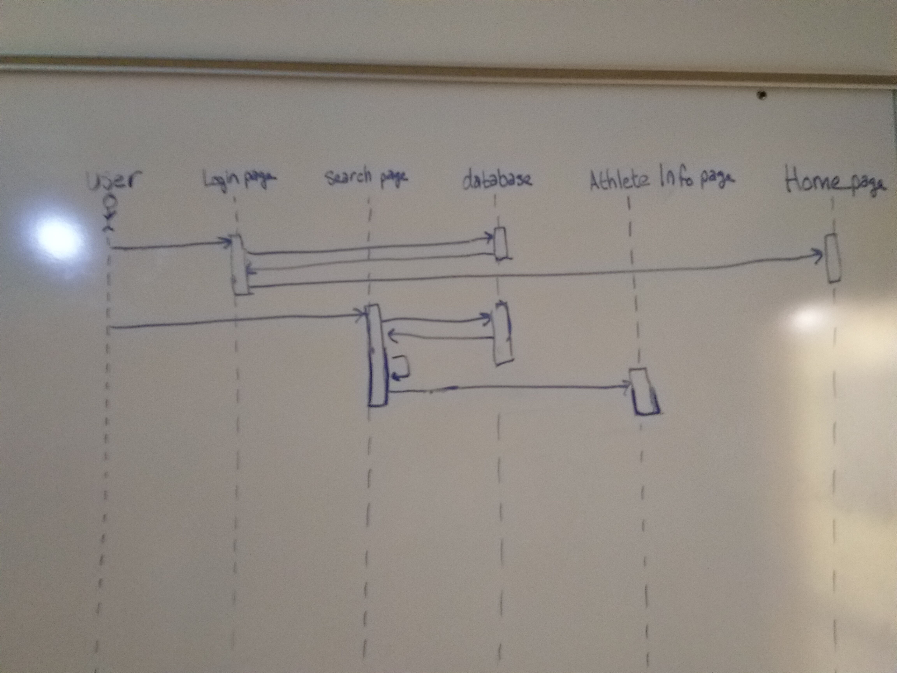
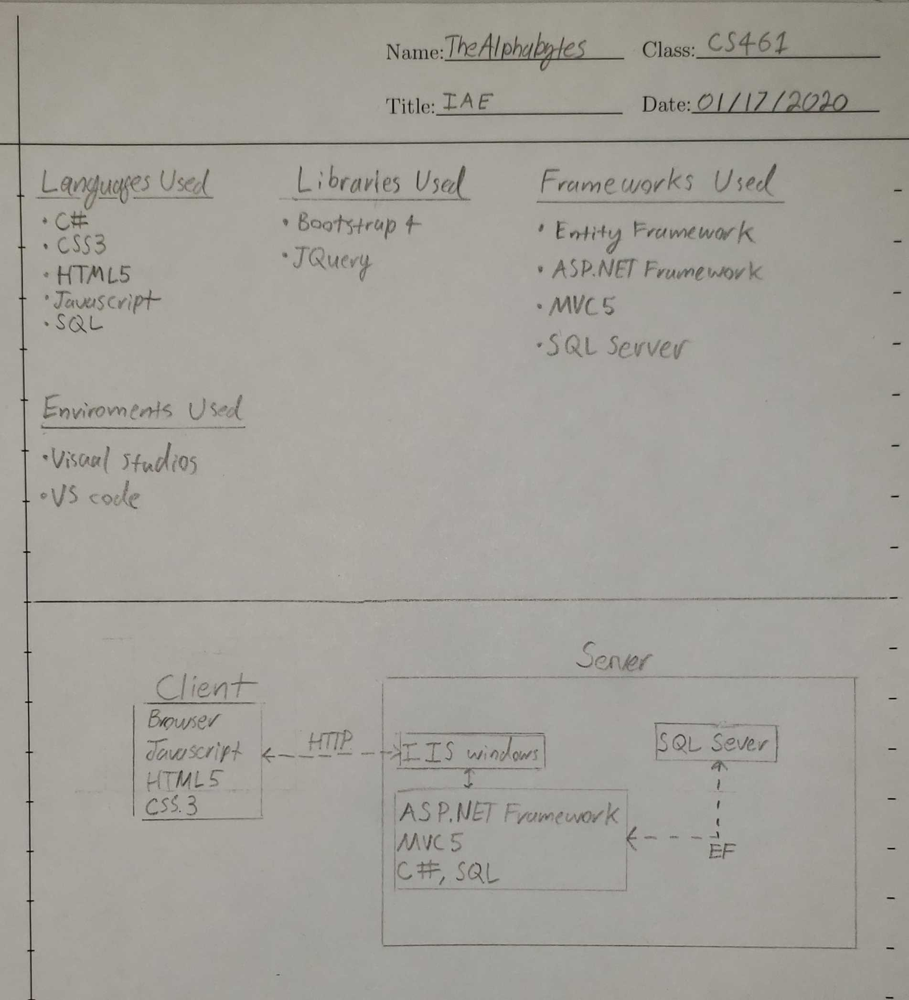

2019-20 Class Project Inception
=====================================

## Summary of Our Approach to Software Development

[What processes are we following?  What are we choosing to do and at what level of detail or extent?]

## Initial Vision Discussion with Stakeholders

Primary Stakeholder -- Katimichael Phelpedecky, swimming legend and hopeful entrepreneur

Katimichael's experience being on the US Olympic team led to an appreciation of how advanced tools can help athletes perform at their best.  The problem is those tools are very expensive and require personnel with advanced training, i.e. elite analysts for elite athletes.  They want to create a business to give regular swimming coaches, from high school, club, college, and masters, advanced analytical and predictive tools to help the athletes on their teams.  Katimichael has assembled a team of investors to fund this project and is hiring your team to create the product.

The product is centered around three core features:

1. Record, store and provide tracking, viewing and simple stats for race results for swimming athletes.  This would have a number of features found in [Athletic.net](https://www.athletic.net/), which is used for Track and Cross Country running.
2. Provide complex analysis of athlete performance over time and over different race types, to give coaches deep insight into their athlete's fitness and performance that they cannot get from their own analyses.  This includes machine learning to predict future performance based on records of past race performance, given different training scenarios.  Validation of this feature will enable the next feature.
3. Create a tool that will optimize a coaches strategy for winning a specific meet.  This feature will automatically assign athletes to specific races based on their predicted race times in order to beat an opponent coache's strategy.  There will be two modes: one in which we have no knowledge of the opponent team's performance, and one where we do have their performance and can predict their times.

## Initial Requirements Elaboration and Elicitation

### Interviews
1. *Are athletes users?*
    * An athlete can be a user, but they are not connected to the athlete in the database. That is, the fact that an athlete is in the database does not make them a user of the system. They can sign-up to be a user, but it will be independent of their status as an athlete.
2. *What data do you want us to store for athletes and coaches?* 
    * I would like to be able to see the first and last name of athletes and coaches. The gender of the athlete is important as well, but I do not need to know the coaches gender.
3. *Are users people?*
    * Of course users are people! In terms of the database though, a user should not be a person, since a person has a first and last name, while the user is only identified by their username, which is an email.

## List of Needs and Features

1. They want a nice looking site, with a clean light modern style, images that evoke swimming and competition.  (More like [Strava](https://www.strava.com/features) and less like [Athletic.net](https://www.athletic.net/TrackAndField/Division/Event.aspx?DivID=100004&Event=14))  It should be easy to find the features available for free and then have an obvious link to register for an account or log in.  It should be fast and easily navigable.  
2. The general public will be able to view all results (just the race distance, type and time).  These are public events and the results should be freely available.  They should be able to search by athlete name, team, coach or possibly event date and location.  Not sure if they want to be able to filter or drill down as Athletic.net does.  They're not trying to organize by state, school, etc. Athletes are athletes and it doesn't matter where they're competing.  This is completely general, but only for swimming.
3. Logins will be required for viewing statistics and all other advanced features.  We eventually plan to offer paid plans for accessing these advanced features.  They'll be free initially and we'll transition to paid plans once we get people hooked.
4. Admin logins are needed for entering new data.  Only employees and contractors will be allowed to enter, edit or delete data.
5. "Standard" logins are fine.  Use email (must be unique) for username and then require an 8+ character password.  Will eventually need to confirm email to try to prevent some forms of misuse.  Admins and contractors must have an offline confirmation by our employees and then the "super" admin adds them manually.
6. The core entity is the athlete.  They are essentially free agents in the system.  They can be a member of one or more teams at one time, then change at any time.  Later when we want to have teams and do predictive analysis we'll let the coaches assemble their own teams and add/remove athletes from their rosters.
7. The first stats we want are: 1) display PR's prominantly in each race event, 2) show a historical picture/plot of performance, per race type and distance, 3) some measure of how they rank compared to other athletes, both current and historical, 4) something that shows how often they compete in each race event, i.e. which events are they competing in most frequently, and alternately, which events are they "avoiding"
8. Athletes can be searched for by name using a search tool.
9. Coaches will be able to automatically generate optimal lineups for winning a given meet, based on the past performance of athletes on their team.
10. Users who are logged in will have a customized dashboard as their homepage, with information tailored to their interests in specific events or athletes.
11.  Athletes can be "favorited" by users with an account so they can be quickly viewed without searching, and those users can see the latest updates about their favorited athletes.

## Initial Modeling

### UML Use Case Diagram

### UML Sequence Diagram

## Identify Non-Functional Requirements

1. User accounts and data must be stored indefinitely.  They don't want to delete; rather, mark items as "deleted" but don't actually delete them.  They also used the word "inactive" as a synonym for deleted.
2. Passwords should not expire
3. Site should never return debug error pages.  Web server should have a custom 404 page that is cute or funny and has a link to the main index page.
4. All server errors must be logged so we can investigate what is going on in a page accessible only to Admins.
5. English will be the default language.
6. All styling will be done with Bootstrap 4 when possible.
7. Pages will be designed with HTML 5.
8. Only data critical to the user experience will be stored, and no user data will be shared with outside resources.

## Identify Functional Requirements (User Stories)

E: Epic  
U: User Story  
T: Task  

1. [U] As a visitor to the site I would like to see a fantastic and modern homepage that introduces me to the site and the features currently available.
   1. [T] Create starter ASP dot NET MVC 5 Web Application with Individual User Accounts and no unit test project
   2. [T] Choose CSS library (Bootstrap 3, 4, or ?) and use it for all pages
   3. [T] Create nice homepage: write initial content, customize navbar, hide links to login/register
   4. [T] Create SQL Server database locally. Hide credentials.
2. [U] As a visitor to the site I would like to be able to register an account so I will be able to access athlete statistics
   1. [T] Copy SQL schema from an existing ASP.NET Identity database and integrate it into our UP script
   2. [T] Configure web app to use our db with Identity tables in it
   3. [T] Create a user table and customize user pages to display additional data
   4. [T] Re-enable login/register links
   5. [T] Manually test register and login; user should easily be able to see that they are logged in
3. [E] As an administrator I want to be able to upload a spreadsheet of results so that new data can be added to our system
   1. [U] As an administrator, I want to have privileged, secure access to our records so that I can modify them as needed
      1. [T] Define a super-user account type with elevated privileges for accessing the database
      2. [T] Make record-modifying actions restricted to this super-user account type and and inaccessible to normal users or guests without accounts
   2. [U] As an administrator, I want to be able to add records to our system by uploading a standardly-formatted spreadsheet, so that I can save time and avoid redundancy
      1. [T] Create an action method for adding an individual record to the database
      2. [T] Create an action method that takes a .csv file and adds each row to the database
4. [U] As a visitor I want to be able to search for an athlete and then view their athlete page so I can find out more information about them
5. [U] As a visitor I want to be able to view race results for an athlete so I can see how they have performed
6. [U] As a visitor I want to be able to view PR's (personal records) for an athlete so I can see their best performances
7. [U] As a user I want to be able to view a graph of race results for a specific athlete and event, so that I can see the athlete's progress over time
8. [U] As a visitor I would like to see cute or funny web pages when errors occur, so that I don't have to worry about complex details of why a piece of the website didn't work
9. [U] As a robot I would like to be prevented from creating an account on your website so I don't ask millions of my friends to join your website and try to add comments about male enhancement drugs.
10. [U] As a coach, I would like to see predictive performances for the athletes on my team, so I can strategize for upcoming meets.
11. [U] As a coach, I would like the ability to have athletes automatically assigned to races for the upcoming meets, so that the team has the optimum chance of winning the meet.
	1. [T] Develop an algorithm to optimize athlete race assignments assuming no knowlege of opponent teams..
	2. [T] Integrate knowlege of opponent team's performances and predict their time.

## Initial Architecture Envisioning

## Agile Data Modeling

## Vision Statement
For swimming athletes and coaches who want professional level analytics and strategies to win meets, the Swimming Predictive Analytics Solution is an indepth website that will provide a platform to track race results for athlete and perform analysis to optimize the teams strategy. Coaches will be able to access insight to their athletes' fitness and trends in performance including predictions on future performance. This solution would allow coaches to develop an optimized strategy for a coming meet by assigning athletes to specific races based on predicted results. Unlike hiring personnel with advanced training, our product would provide all analysis and storage of race results in one place for a fraction of the expense making elite analytics accessible to teams of any level.

## Timeline and Release Plan
